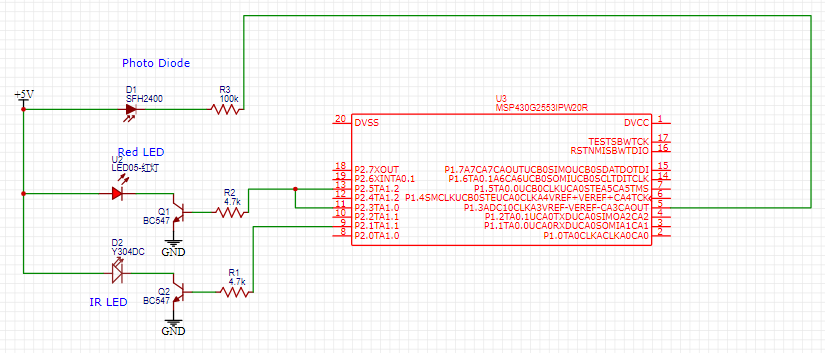

# ELEC 327: MSP430G2253 Pulse Oximeter with LCD Display

## Pitch/Presentation

[Youtube Link](https://youtu.be/LEoGDcVfMGc)

## Materials and Schematics

- MSP430G2553 Launchpad
- 2 4.7k ohm resistors
- IR emitter diode
- Red LED
- Photo Diode (light wavelength range from 400 to 1100 Hz)
- 1 100k ohm resistors
- 1 breadboard
- 2 BC547 BJTs
- Many wires
- Nail clip
- Black tape
  
### Pulse Oximeter Schematic

### Pulse Oximeter Picture

## Code Architecture

### Pulse Oximeter Block Diagram

### PWM
The Red and IR emitter LED flash on a 50% duty cycle such that when the Red LED is ON, the IR LED is OFF and vice versa. Timer A1 was utilized for the PWM and the frequency was about 100Hz. In order to accurately collect the sensor data from the photodiode, the readings were measured on the rising edge of the PWM signals so that values measured would indeed correspond to their respective LED. A Port 2 interrupt was utilized to send a flag that the next piece of data could start being collected as well as change the edge trigger of the interrupt (since it was being done of a single PWM signal where the negative edge of one signal is the positive edge of the other).

### Analog to Digital Conversion
Pin 1.3 on the MSP was used to do the analog to digital conversion. The A/D conversion would stall the code until it was completed and then add the value (usually between 400-800 out of 1023) to a variable which would then be averaged over 10 samples. This sampling process would happen 5 times before moving to calculations.

### Calculations
The average of the sampled data points would then be used to find the lowest and highest readings for both the red and the IR emitter diodes. The minimum and maximum values would be constantly be updated to form a value for the ratio R =  ( (REDmax-REDmin) / REDmin) / ( (IRmax-IRmin) / IRmin ). This value would then be used to calculate SpO2 = m * R + b. The values of m (slope) and b (y intercept) need to be calibrated to get accurate readings.

### Display
Serial connection via Teraterm was used to gather a log of readings from the MSP and then stored in a CSV file. The CSV file was read in realtime to update python code of the new values. The display utilized matplotlib to show a live calculation and plot of SpO2 values over time, print out the current SpO2 val opn the title, and display if the oxygen content was in the process of being calculated (or if there was no finger inserted).

